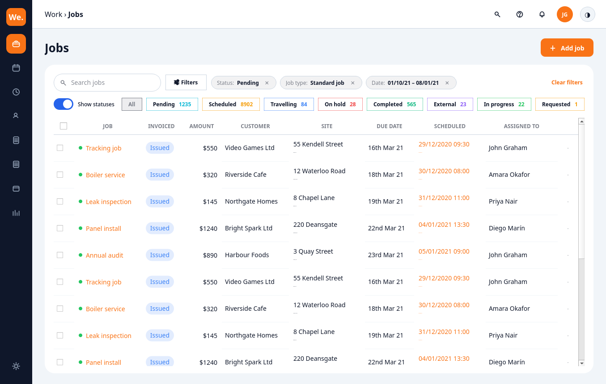

# Aurora Jobs Table

A WorkEver-style **"Jobs"** screen built entirely from the Custom Widgets data-table
stack — `QCustomDataTable` + `QCustomTableToolbar` — fully tokenized and
light/dark theme-aware.



## What it demonstrates

**Rich cells** (via `DataTableColumn(renderer=...)` + the `QCustomDataTableDelegate`):

| Column | Renderer | Notes |
| --- | --- | --- |
| JOB | `status` | green status dot + orange (accent) link text |
| INVOICED | `badge` | soft "Issued" pill (`colorMap`) |
| AMOUNT | `currency` | right-aligned money (`formatter`) |
| SITE | `twoline` | street over a muted town line (`subtitleKey`) |
| SCHEDULED | `twoline` | two **orange** lines (`subtitleKey` + `colorKey`) |
| CUSTOMER / DUE DATE / ASSIGNED TO | — | plain text |

**Selection & actions** (on `QCustomDataTable`):

- a leading **checkbox column** with a tri-state **select-all header**
  (`selectable=True`, `checkedRows()`, `selectionCheckedChanged`)
- a trailing **kebab (⋮) actions column** — clicking opens a menu and emits
  `rowActionTriggered(sourceRow, key)` (`setRowActions([...])`)

**Toolbar** (`QCustomTableToolbar`):

- search box (`searchChanged` → `table.setFilterText`)
- a Filters button, removable filter chips (`filterChipRemoved`), Clear filters
- colour-coded **status pills with counts** + a "Show statuses" switch
  (`statusSelected`, `showStatusesToggled`)

## Run

```bash
python main.py                 # windowed — click the ⋮, checkboxes, pills, ◑ theme toggle
python main.py --shots ./out   # write out/jobs_light.png + jobs_dark.png, then quit
```

The whole screen is themed with `applyDesignTokens(app, tokens)`; the shell chrome
is derived from token **roles** (so it flips with the theme), and the widgets track
the theme through `table.setCellAccentColor(...)` / `toolbar.setThemeColors(...)`.
The status hues (green / orange / amber / …) are intentionally *data* colours, kept
out of the token roles.

> Free-core, read-only table. Inline editing, virtualization, frozen columns and
> export live in the commercial `QCustomDataTablePro`.
