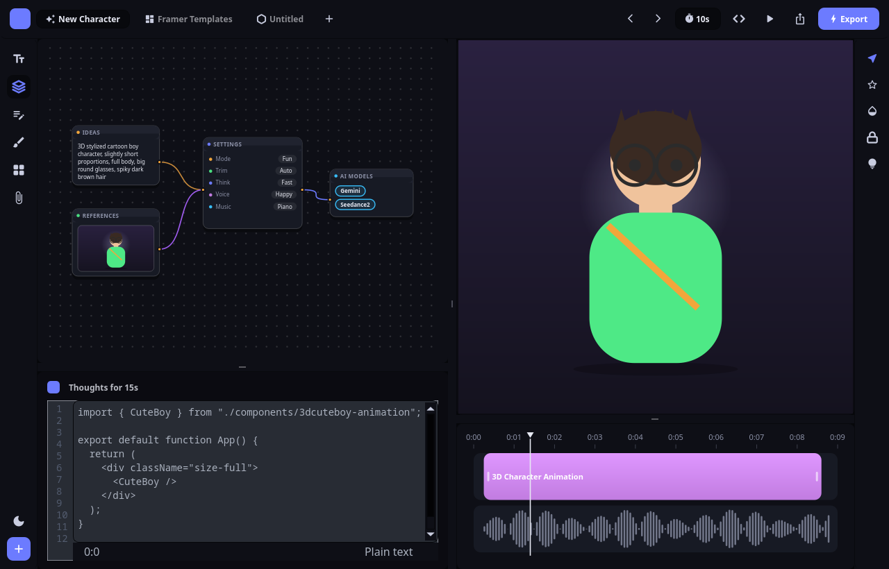

# Node Studio

A node-based **AI creative-tool** UI built entirely on Custom_Widgets — the
"New Character" AI-generation studio from the reference: a wired node canvas, a
reasoning code panel, a 3D-character preview, and a media timeline, in one dark
(and light) screen.



## What it demonstrates

This is a real **forms-pipeline** app (not a pure-code demo):

```
ui/MainWindow.ui        structure + objectNames only (promotes the custom widgets)
  -> src/ui_MainWindow.py   compiled via `Custom_Widgets --convert-ui`
json-styles/style.json  Studio Dark / Studio Light themes + a NodePalette section
Qss/scss/chrome.scss    all chrome via $TOKENS + #objectName selectors (no hex)
gui/GuiFunctions.py      logic: feeds the widgets data, paints the preview, theming
gui/theme.py             reads NodePalette / icon colours from style.json
main.py                  minimal boot
```

Two **new library widgets** were built for this screen and are reused from the
canvas/timeline:

- **`QCustomNodeGraph`** — pan/zoom dotted-grid canvas hosting draggable node
  cards (title + accent dot, text / label-value rows / image / chips), typed
  input/output ports, and drag-to-connect bezier cables. Data-driven via
  `setGraph({nodes, edges})`; emits `nodeMoved` / `connectionMade` / …
- **`QCustomMediaTimeline`** — a ruler with labelled ticks, a draggable
  playhead, and track lanes of movable/trimmable clip regions plus a waveform
  lane. `setTimeline({duration, position, tracks})`; emits `positionChanged` /
  `clipMoved` / `clipTrimmed`.

Existing widgets carry the rest: `QCustomQPushButton` (tabs, rails, Export),
`QCustomCodeEditor` (the "Thoughts" panel, `one-dark`/`one-light`), and a
painted `QLabel` pixmap for the 3D preview.

## Run it

Through the Custom Widgets MCP (preferred): `designer_run_app` on this project.

Or directly:

```bash
# from the repo root, with the project venv active
cd examples/PySide6/NodeStudio
Custom_Widgets --convert-ui ui --qt-library PySide6 --src-output-dir src   # after editing any .ui
python main.py
```

## Interactions

The whole screen responds to clicks (visual, not a real backend):

- **Tabs** (top) and **both tool rails** are exclusive selectable controls — a
  click makes it the active one; the selected tool's icon glows accent.
- **Theme toggle** (moon, bottom-left rail) flips Studio Dark ⇄ Studio Light —
  the node canvas, timeline, code editor, preview and every icon re-tint from
  the token-driven `NodePalette`.
- **Play** (top bar) animates the timeline playhead and swaps to a pause icon;
  the **`10s` pill** cycles the timeline duration (10→15→30→5s); the **nav
  arrows** nudge the playhead a second.
- **Export / Share / source** buttons raise a toast; the **`+` FAB** drops a new
  wireable node onto the canvas.
- **Click a SETTINGS row** on the canvas to cycle its value — and it's *wired to
  the render*: **Voice** repaints the character's shirt colour, **Mode** retints
  the stage glow (functional, not cosmetic).
- The **Thoughts** panel is real JavaScript with syntax highlighting
  (`QCustomCodeEditor` gained a `javascript`/`ts` grammar).
- On the canvas: **drag** nodes, **wheel** to zoom, drag empty space to pan,
  drag from one port to another to wire a new cable.
- On the timeline: drag the ruler/playhead to scrub, drag a clip to move it,
  drag its edges to trim.

### Editing nodes (layers)

Hover or select a node to reveal a **pen** and **×** in its header.

- **Delete**: click **×**, or select a node and press **Delete/Backspace**, or
  **right-click → Delete node**. Its cables go too.
- **Disconnect**: **click a cable** to select it (it highlights) then **Delete**,
  or **right-click a cable → Disconnect**, or the panel's **Disconnect** button.
- **Edit**: click the **pen** to open the **Properties panel** (opens *only* via
  the pen, so it never fights dragging) — edit **Title**, **Text**, and the
  **Colour** (a `QCustomColorPicker`; the node recolours live — dot + header
  underline + chips + glow).
- Both animated widgets are user-controllable: `QCustomNodeGraph.animated` /
  `QCustomMediaTimeline.animated` (enable/disable) + `play()`/`pause()`/
  `togglePlay()` on the timeline.

## Notes / gotchas captured here

- The preview `QLabel` uses an **Ignored** size policy — a pixmap set on a
  default-policy label grows its sizeHint → the layout grows → resize → repaint
  → unbounded growth. Ignored policy + a size guard keep it stable.
- `QCustomCodeEditor` now takes `parent=None` so it can be promoted in a `.ui`
  (uic instantiates promoted widgets as `Widget(parent)`).
- Theme is persisted by QSettings between runs; `Default-Theme:true` only sets
  the first-run theme.
- **Icons: file via QSS url, colour via `iconColor`** — never `setIcon` in Python.
  The icon file is `qproperty-icon: url($PATH_RESOURCES+'…')` (also in the `.ui`
  iconset for Designer preview); the custom button **tints** it to
  `qproperty-iconColor` (resting) / `qproperty-iconColorActive` (checked), so the
  **selected tool's icon turns accent** and recolours on theme change. The active
  colour is a *base-rule* property the button swaps to on toggle — **not**
  `:checked { qproperty-… }` (Qt doesn't re-apply `qproperty-*` from a pseudo-state
  selector). `iconSize` is per button in the `.ui`. (There is no `iconName`.)
- QSS is **nested per component**, keyed by objectName (`#topBar { … }`,
  `#CanvasComponent { … }`, `#nodePanel { … }`).
- Two node-paint gotchas fixed here: `recolor_icon` must NOT be called inside a
  `paintEvent` (it opens its own painter → corrupts the frame) — pre-render icons;
  and never name a paint loop variable `rect` (it clobbers the node rect and the
  later `setClipRect(rect)` hides the body).
